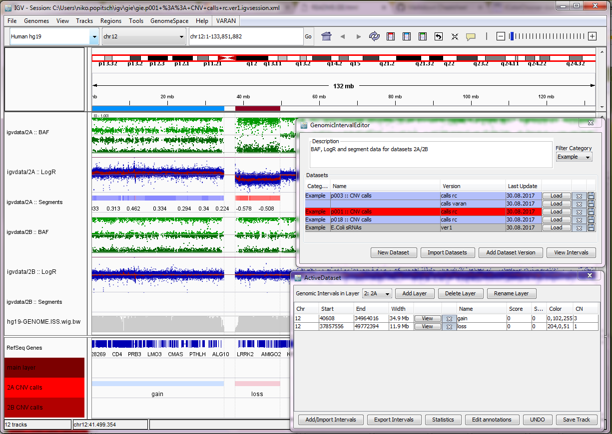

# VARAN-GIE: An IGV extension for the annotation of genomic intervals. 
	
## Introduction
	
VARAN-GIE (aka "VARAN") is a *branch* of [Broad's popular Integrative Genomics Viewer (IGV)](http://software.broadinstitute.org/software/igv/).
It *extends* the IGV by adding **functionality to create, edit and annotate sets of genomic intervals**.
By this, VARAN supports an integrative approach to viewing and annotating large genomic data sets. 

Core functionality of VARAN includes:

* **Simple and intuitive editing and annotation of genomic interval sets** 
    * Editing functionality includes: add/delete/clip/merge.
    * VARAN supports authoring of complex annotation sets containing potentially overlapping intervals on multiple layers.

* **Simple merging/curation of multiple genomic interval sets (e.g., a set of BED files)**
    * Intervals can be organized in multiple custom layers to enable the authoring of complex annotation sets

* **Interval annotation capabilities**
    * VARAN supports editing of extended BED features such as score, strand and color and arbitrary custom attributes

* **Comprehensive navigational capabilities**
    * E.g., zoom to intervals/endpoints, forward/back in interval list, etc.

* **Session management: users can easily switch between different VARAN annotation data sets/versions.**
    * Datasets can be organized in custom categories by the user

* **Export functionalites**
    * Interval sets can be exporteed in spreadsheet-compatible formats (CSV/TSV) or as UCSC bed tracks
    * Whole datasets can be exported as zipped "bundles" and exchanged with other researchers (referenced file paths can be mapped to new locations at import)

* **Autosave, versioning and "undo" functionalities**

VARAN was developed at the [Children's Cancer Research Institute (CCRI)](http://science.ccri.at/) where we have used it in several projects (e.g., for curating CNV calls coming out of bioinformatics pipelines or for visualizing and editing data in a gene panel project).

## Screenshot

* The main IGV window in the background shows the data for two SNP array datasets (2A and 2B) that were created by a bioinformatics pipeline that extracts and analyses BAF and LogR signals and predicts CNV segments from these data. The fragmented output from this pipeline ("Segments" tracks) was curated using VARAN's interval editing functionality, resulting in two segments (a gain and a loss) for datasets 2A. The segements are indicated by the blue and red bars above the data tracks and in the "2A" track.
* The upper window in the foreground shows all datasets in the "Example" category known to the running VARAN instance. The first dataset ("p003") has 2 different versions, the second one ("p001") is currently loaded. 
* The lower window in the foreground shows the two intervals that are currently stored in layer "2A".

## Application scenarios

* Manual curation of genomic annotations, e.g., gene lists, CNV or SV calls, novel transcripts
* Merging and curation of multiple BED files
* De-novo authoring of *multi-layer* interval sets 
* etc.

## VARAN Key Mappings

|Key|Mapping|
|---|-----|
|CTRL-ALT-A|Add region (hold CTRL to merge new region with all overlapping)|
|CTRL-ALT-C|Clip region|
|CTRL-ALT-M|Merge visible/selected regions|
|CTRL-ALT-D|Delete visible/selected regions|
|CTRL-ALT-R|Save and reload BED track|
|CTRL-F|Next (downstream) region|
|CTRL-B|Previous (upstream) region|
|CTRL-Z|Undo last action|
|CTRL-C|Copy region coordinates|
|CTRL-H|Show/hide reference lines|
|CTRL-#|Switch to layer (#=1..9)|

	
## IGV modifications and bugfixes

VARAN also includes several bugfixes and other extensions of the branched IGV version:
* "Load session" allows to extend/merge current session.
* Overlay track handling: track context menu allows to set windowing function and height for overlay tracks; configured renderer of overlay-tracks is kept when session is saved
* Proper UTF-8 encoding of session XML.
* Many smaller bugfixes (see commit logs for details)

## Roadmap for next version

* Enable filtering interval lists by name, chrom, etc.
* Automated merging support
* Improved statistics and overview graphs
* Improve undo to also support interval edits (currently only additions/removals of intervals are tracked)
* http(s) URI support
